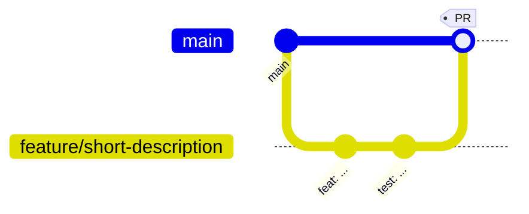

# Contributing to Amadeus-chat

Thank you for considering a contribution. Amadeus-chat is a small, focused project
with a clear design philosophy, and contributions that respect that philosophy
are very welcome.

- **Be deterministic-first.** New functionality should work without an LLM
  wherever possible. The model is a short-lived, optional resource — never a
  hard dependency on a hot path.
- **Stay low-RAM.** Avoid heavyweight dependencies (e.g. PyTorch,
  `sentence-transformers`). If a feature needs one, it must be optional.
- **Keep it stateless.** Each invocation starts, does one job, and exits.

By participating you agree to abide by our [Code of Conduct](CODE_OF_CONDUCT.md).

## Table of Contents

- [Ways to Contribute](#ways-to-contribute)
- [Development Environment](#development-environment)
- [Git Workflow](#git-workflow)
- [Branch Naming](#branch-naming)
- [Commit Conventions](#commit-conventions)
- [Coding Standards](#coding-standards)
- [Tests](#tests)
- [Pull Request Checklist](#pull-request-checklist)
- [Reporting Bugs](#reporting-bugs)
- [Requesting Features](#requesting-features)

## Ways to Contribute

- Fix bugs or improve error handling.
- Add deterministic features or improve existing ones.
- Improve documentation (this set lives under `docs/`).
- Add or strengthen tests.
- Triage issues and reproduce reports.

## Development Environment

```bash
git clone https://github.com/adityatawde9699/Amadeus-chat.git
cd Amadeus-chat
uv sync --extra dev --extra llm   # dev tooling + optional LLM
uv run pytest                      # confirm a green baseline
```

Full setup and workflow details: [docs/development.md](docs/development.md).

## Git Workflow

Amadeus uses a simple **feature-branch** workflow against `main`.



1. Fork the repository (external contributors) or create a branch (maintainers).
2. Branch from an up-to-date `main`.
3. Make focused commits using the conventions below.
4. Ensure `uv run pytest` is green and `python -m compileall amadeus` passes.
5. Open a Pull Request describing **what** changed and **why**.

## Branch Naming

Use a `type/short-description` slug:

| Prefix | Use for |
| --- | --- |
| `feat/` | New functionality |
| `fix/` | Bug fixes |
| `docs/` | Documentation only |
| `refactor/` | Internal restructuring, no behaviour change |
| `test/` | Test additions or changes |
| `chore/` | Tooling, dependencies, housekeeping |

Examples: `feat/note-tags`, `fix/research-timeout`, `docs/api-reference`.

## Commit Conventions

This project follows [Conventional Commits](https://www.conventionalcommits.org/).

```text
<type>(<optional scope>): <imperative summary>

<optional body explaining the why>

<optional footer(s)>
```

Allowed types: `feat`, `fix`, `docs`, `style`, `refactor`, `perf`, `test`,
`build`, `ci`, `chore`, `revert`.

Examples:

```text
feat(notes): add tag-based filtering to learn search
fix(git_assist): keep the index untouched when a commit is aborted
docs(architecture): add the research data-flow diagram
```

> Amadeus-chat can write these for you: `amadeus git commit` proposes a Conventional
> Commit message from your diff.

## Coding Standards

- **Python ≥ 3.12**, type hints encouraged (`from __future__ import annotations`).
- Keep modules cohesive: one feature area per module under `amadeus/modules/`.
- Route all file I/O through `amadeus/core/storage.py`; all terminal output
  through `amadeus/utils/display.py`. Do not import `rich` directly in modules.
- Load the LLM only inside `utils.llm.llm_session()`; never at import time.
- Prefer the standard library; justify every new third-party dependency.
- Match the surrounding style: docstrings on public functions, concise comments
  explaining *why*, not *what*.

Recommended tooling (not enforced by CI yet, but appreciated):

```bash
uv run ruff check amadeus        # lint (if installed)
uv run ruff format amadeus       # format
```

## Tests

- Add or update tests for every behavioural change.
- Tests must be **network-free** and isolated to `tmp_path` — never touch the
  real `~/.amadeus`. Use the `home` / `cfg` fixtures in `tests/conftest.py`.
- Mock `subprocess` and `requests` rather than calling out.

```bash
uv run pytest -q
uv run pytest --cov=amadeus --cov-report=term-missing
```

See [docs/testing.md](docs/testing.md).

## Pull Request Checklist

- [ ] Branch follows the naming convention.
- [ ] Commits follow Conventional Commits.
- [ ] `uv run pytest` passes locally.
- [ ] `python -m compileall amadeus` passes.
- [ ] New/changed behaviour is covered by tests.
- [ ] Documentation updated where relevant.
- [ ] No new heavyweight or non-optional dependencies.
- [ ] `CHANGELOG.md` updated under `[Unreleased]`.

## Reporting Bugs

Open an issue with: your OS and Python version, the exact command, the full
output (redact secrets), and what you expected. A minimal reproduction is ideal.

## Requesting Features

Describe the problem you are trying to solve, not just the solution. Explain how
it fits the deterministic-first, low-RAM philosophy.
