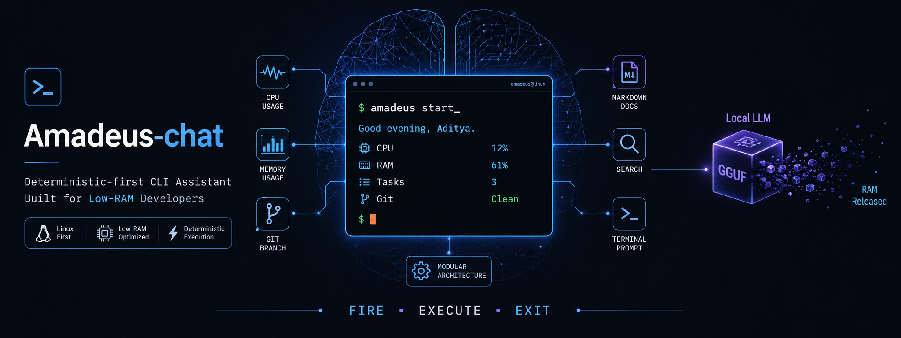
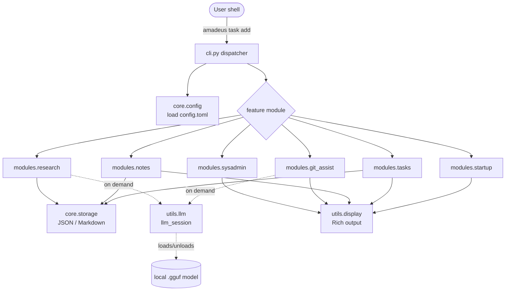

<!-- Project banner -->
<p align="center">
  <!-- Replace with a real banner image, e.g. docs/assets/banner.png -->
  
</p>

<h1 align="center">Amadeus-chat</h1>

<p align="center">
  <strong>Deterministic-first, fire-and-forget CLI assistant for low-RAM laptops.</strong>
</p>

<p align="center">
  <a href="#license"></a>
  
  
  
  
  
</p>

<p align="center">
  <em>A companion CLI to <a href="https://github.com/adityatawde9699/Amadeus-AI">Amadeus-AI</a>, the autonomous agent — the same assistant ideas, distilled into a one-shot command for machines that cannot spare a resident model.</em>
</p>

---

## Table of Contents

- [Overview](#overview)
- [Problem Statement](#problem-statement)
- [Features](#features)
- [Screenshots](#screenshots)
- [Demo](#demo)
- [Architecture Overview](#architecture-overview)
- [Technology Stack](#technology-stack)
- [Installation](#installation)
- [Configuration](#configuration)
- [Environment Variables](#environment-variables)
- [Quick Start](#quick-start)
- [Usage Examples](#usage-examples)
- [Folder Structure](#folder-structure)
- [Development Setup](#development-setup)
- [Testing](#testing)
- [Deployment](#deployment)
- [Performance Notes](#performance-notes)
- [Security](#security)
- [Roadmap](#roadmap)
- [Contributing](#contributing)
- [License](#license)
- [Author](#author)
- [Acknowledgements](#acknowledgements)
- [Support](#support)
- [FAQ](#faq)

---

## Overview

**Amadeus-chat** is a local command-line assistant designed for machines with
very little RAM. It is a side product of [**Amadeus-AI**](https://github.com/adityatawde9699/Amadeus-AI),
an autonomous agent — where Amadeus-AI runs as a long-lived agent, Amadeus-chat
distils the same everyday developer chores into a single, short-lived `amadeus`
command.

It bundles a morning dashboard, task tracking, a personal knowledge base with
full-text search, git assistance, web research, and system maintenance into one
binary. The console command is `amadeus`; the Python import package is `amadeus`;
the distribution package is `amadeus-chat`.

Its defining principle is **deterministic-first**: the overwhelming majority of
operations are plain, fast Python with no machine-learning dependencies. A local
Large Language Model (LLM) is loaded **only** for the two operations that
genuinely benefit from generative text — git commit-message authoring and
research summarization — and is **unloaded immediately afterwards**, returning
its ~1.5 GB of RAM to the operating system.

There is no daemon, no background process, no database server, and no network
service. Each invocation starts, does exactly one job, prints the result, and
exits. The OS reclaims all memory for free.

> **In one sentence:** Amadeus-chat gives you a useful local assistant whose idle
> footprint is a shell prompt, not a 1.5 GB resident model.

## Problem Statement

Local AI assistants typically pin a quantized model in memory for the lifetime
of a chat session. On a 4 GB laptop this is crippling: the model alone consumes
30–40% of available RAM before you have done any work, and most of the
"assistant" tasks you actually perform (listing tasks, checking disk space,
searching notes) never needed a model in the first place.

Amadeus-chat was built to answer a narrower question:

> *What does a genuinely useful developer assistant look like if you are not
> allowed to keep a model resident?*

The answer is a **fire-and-forget CLI** where determinism is the default and the
model is a short-lived, on-demand resource.

| Persistent agent / REPL | Amadeus-chat (fire-and-forget CLI) |
| --- | --- |
| LLM pinned in RAM for the whole session | LLM loaded on demand, released on exit |
| ~1.5 GB idle baseline | Tens of MB idle baseline |
| Chat-style interaction | `command → output → exit` |
| Single large process | Modular package, one command per module |
| Sliding-window memory management | Stateless; each invocation is independent |

## Features

| # | Feature | Command | Needs LLM? | Description |
| --- | --- | --- | --- | --- |
| 1 | Daily dashboard | `amadeus start` | No | System snapshot + open tasks + per-project git status |
| 2 | Task management | `amadeus task …` | No | Add / list / complete / delete tasks in plain JSON |
| 3 | Knowledge base | `amadeus learn …` | No | Markdown notes with deterministic BM25L search |
| 4 | Git assistant | `amadeus git …` | Optional | Smart status; commit messages (LLM or deterministic) |
| 5 | Web research | `amadeus research …` | Optional | Scrapes, extracts, and summarizes into a report |
| 6 | System maintenance | `amadeus sys …` | No | Resource status and allow-listed cleanup |
| 7 | Configuration | `amadeus config` | No | Inspect effective configuration |

Highlights:

- **Optional local LLM** — features degrade gracefully to deterministic
  templates when no model (or `llama-cpp-python`) is available.
- **Reasoning-model aware** — `<think>…</think>` blocks are stripped and
  `/no_think` is sent for commit generation (Qwen3-class models supported).
- **Portable storage** — everything is plain JSON and Markdown under
  `~/.amadeus/`; back it up with `cp`, inspect it with `grep`.
- **Safe by default** — atomic writes, commit confirmation, an allow-list for
  cleanup, and a `--dry-run` for destructive operations.

## Screenshots

> Screenshots are illustrative. Add real captures under `docs/assets/`.

```text
Amadeus-chat  ·  Good evening, Amadeus User.  ·  2026-06-26 22:53
─────────────────────────── System Snapshot ───────────────────────────
  CPU      Load 0.41/0.55/0.60  ·  Cores 4  ·  CPU 12.0%
  RAM      Used 61.2%  ·  Available 1.4 GB  ·  Total 3.7 GB
  Disk /   Used 74.0%  ·  Free 28.1 GB  ·  Total 117.0 GB
──────────────────────────── Today's Tasks ────────────────────────────
  1  ·  Finish the documentation pass
  2  ·  Review research report on Rust ownership
```

## Demo

```console
$ amadeus learn search "borrow checker"
─────────────────────────── BM25 Search Results ───────────────────────────
 Score   Note               Snippet
 2.71    Rust Ownership     …ownership and the borrow checker guarantee memory…
 0.94    Memory Safety      …without a garbage collector, the borrow checker…
```

A short asciinema/GIF demo can be embedded here once recorded:

```markdown
[](https://asciinema.org/a/PLACEHOLDER)
```

## Architecture Overview

Amadeus-chat is a **modular CLI dispatcher**. A thin argparse front-end
(`amadeus/cli.py`) parses a subcommand and delegates to a single feature module.
Cross-cutting concerns (config, storage, display, LLM lifecycle) live in shared
packages.



The LLM is the only heavyweight resource, and it exists only inside the
`llm_session()` context manager. See [docs/architecture.md](docs/architecture.md)
for request lifecycle, data flow, and the AI pipeline.

## Technology Stack

| Layer | Technology | Purpose |
| --- | --- | --- |
| Language | Python ≥ 3.12 | Implementation |
| CLI | `argparse` (stdlib) | Command dispatch |
| Terminal UI | [`rich`](https://github.com/Textualize/rich) | Tables, panels, colour |
| Search | [`rank-bm25`](https://github.com/dorianbrown/rank_bm25) (BM25L) | Deterministic note search |
| System metrics | [`psutil`](https://github.com/giampaolo/psutil) | RAM / CPU / disk / battery |
| HTTP | [`requests`](https://requests.readthedocs.io) | Web research fetch |
| HTML parsing | [`beautifulsoup4`](https://www.crummy.com/software/BeautifulSoup/) | Text extraction |
| LLM (optional) | [`llama-cpp-python`](https://github.com/abetlen/llama-cpp-python) | Local GGUF inference |
| Packaging | [`uv`](https://github.com/astral-sh/uv) / `setuptools` | Build & dependency management |
| Tests | [`pytest`](https://pytest.org) + `pytest-cov` | Test suite |

## Installation

> Full details and troubleshooting: [docs/installation.md](docs/installation.md).

### With `uv` (recommended)

```bash
git clone https://github.com/adityatawde9699/Amadeus-chat.git
cd Amadeus-chat

uv sync                 # base (deterministic features only)
uv sync --extra llm     # + llama-cpp-python (local LLM)
uv sync --extra dev     # + pytest (test suite)
```

### With `pip`

```bash
python -m venv .venv && source .venv/bin/activate
pip install -e .            # base
pip install -e ".[llm]"     # + local LLM support
pip install -e ".[dev]"     # + test tooling
```

If `llama-cpp-python` is not installed or no model is discoverable, the
LLM-backed features automatically fall back to deterministic output.

## Configuration

Configuration lives at `~/.amadeus/config.toml` and is created with sensible
defaults on first run. Amadeus-chat **never overwrites** it once it exists.

```toml
[user]
name = "Amadeus User"

[paths]
projects = ["~/projects/Amadeus-chat", "~/work/api"]   # scanned by `amadeus start`

[model]
path = ""            # empty -> auto-discovery (see Environment Variables)
n_ctx = 2048
n_threads = 0        # 0 = auto-detect physical cores
n_batch = 256
max_tokens = 384
temperature = 0.4

[git]
auto_stage = true
default_type = "chore"   # or "auto" for heuristic type inference

[research]
max_pages = 5
fetch_timeout = 15
user_agent = "Mozilla/5.0 (compatible; Amadeus-Research/1.0)"

[sys]
ram_warn_mb = 800
disk_warn_gb = 5
clean_targets = ["/var/cache/apt/archives", "/tmp/amadeus"]
```

See [docs/configuration.md](docs/configuration.md) for every option.

## Environment Variables

| Variable | Default | Description |
| --- | --- | --- |
| `AMADEUS_MODEL_PATH` | _(unset)_ | Absolute path to a `.gguf` model; second in the discovery order |
| `EDITOR` | `nano`/`vim`/`vi` | Editor opened by `amadeus learn new` |

Amadeus-chat is configuration-file-first; only the two variables above affect
runtime behaviour. The model **discovery order** is:

1. `[model].path` in `config.toml`
2. `$AMADEUS_MODEL_PATH`
3. The first `*.gguf` in `~/.amadeus/models/`

## Quick Start

```bash
# 1. Install
uv sync

# 2. See your morning dashboard (creates ~/.amadeus on first run)
amadeus start

# 3. Track work
amadeus task add "Write the architecture doc"
amadeus task list

# 4. Capture knowledge
amadeus learn new "BM25 vs embeddings" --no-edit --body "BM25L is deterministic."
amadeus learn search "deterministic"

# 5. (Optional) enable the local LLM
mkdir -p ~/.amadeus/models
ln -s /path/to/model.gguf ~/.amadeus/models/
amadeus config | grep model.path
amadeus git commit          # now writes a Conventional Commit message
```

## Usage Examples

```bash
# Daily operations
amadeus start
amadeus task add "Finish X"
amadeus task list --all
amadeus task done 1
amadeus task delete 1

# Developer tools
amadeus git status
amadeus git commit                       # propose -> confirm -> commit
amadeus git commit -y                     # skip confirmation
amadeus git commit --default-type feat    # override fallback type

# Knowledge base
amadeus learn new "Qwen2" --no-edit --body "..."
amadeus learn list
amadeus learn search "scheduler"
amadeus learn show qwen2

# Research
amadeus research "rust ownership model"
amadeus research "rust ownership model" --no-llm

# System
amadeus sys status
amadeus sys clean --dry-run
amadeus sys clean

# Config
amadeus config
amadeus config --path
```

More worked examples: [docs/examples.md](docs/examples.md). Full command
reference: [docs/cli.md](docs/cli.md).

## Folder Structure

```text
Amadeus-chat/                 # repository root
├── amadeus/                  # Python package (import name)
│   ├── cli.py                # argparse dispatcher (entry point: amadeus)
│   ├── core/
│   │   ├── config.py         # config.toml loader + model discovery
│   │   └── storage.py        # JSON/Markdown I/O, slugify, atomic writes
│   ├── modules/
│   │   ├── startup.py        # `amadeus start`
│   │   ├── tasks.py          # `amadeus task …`
│   │   ├── notes.py          # `amadeus learn …` (+ BM25L)
│   │   ├── git_assist.py     # `amadeus git …`
│   │   ├── research.py       # `amadeus research …`
│   │   └── sysadmin.py       # `amadeus sys …`
│   └── utils/
│       ├── llm.py            # lazy LLM lifecycle (llm_session)
│       └── display.py        # Rich rendering helpers
├── tests/                    # pytest suite (no network, temp-home isolated)
├── scripts/
│   └── benchmark.py          # measured performance figures
├── docs/                     # this documentation set
├── pyproject.toml            # single source of dependencies (dist: amadeus-chat)
├── uv.lock                   # pinned, reproducible resolution
├── requirements.txt          # generated from pyproject (pip users)
└── README.md
```

Detailed responsibilities: [docs/architecture.md#folder-responsibilities](docs/architecture.md#folder-responsibilities).

## Development Setup

```bash
uv sync --extra dev --extra llm
uv run python -m compileall amadeus     # syntax check
uv run pytest                            # run the suite
uv run amadeus --help                    # smoke test
```

See [docs/development.md](docs/development.md) for the full workflow, coding
standards, and commit conventions.

## Testing

```bash
uv run pytest                 # 57 tests, no network, isolated to a temp home
uv run pytest --cov=amadeus   # with coverage
```

Tests never touch your real `~/.amadeus` directory or the network. See
[docs/testing.md](docs/testing.md).

## Deployment

Amadeus-chat is a **local, single-user CLI** — there is no server to deploy. The
"deployment" surface is distribution and unattended invocation (e.g. via `cron`).
A Docker image is provided for reproducible, headless runs. See
[docs/deployment.md](docs/deployment.md).

## Performance Notes

Measured with `uv run python scripts/benchmark.py` on a 4-core, 3.7 GB-RAM Linux
laptop (Python 3.12) using a 1.2 GB `Qwen3.5-2B.Q4_K_M.gguf` model.

| Metric | Measured |
| --- | --- |
| Cold start (`amadeus config --path`) | ~0.57 s |
| Cold-start peak RSS | ~50 MB |
| Note search (200-note corpus, warm cache) | ~40 ms |
| LLM load time (warm file cache) | ~1.8 s |
| LLM resident memory while loaded | ~1.1–1.9 GB |
| LLM commit-message completion | ~1–3.5 s |

Deterministic commands stay in the tens-of-MB range; the multi-GB cost is paid
only while a model is loaded, then released. See [docs/performance.md](docs/performance.md).

## Security

Amadeus-chat runs entirely on your machine with your privileges; it sends no
telemetry. The main risk surfaces are: the web-research fetcher (external HTML),
the system-cleanup allow-list, and git subprocess execution. See
[docs/security.md](docs/security.md) and [SECURITY.md](SECURITY.md) for the
threat model and vulnerability-reporting process.

## Roadmap

A summary lives in [ROADMAP.md](ROADMAP.md). Highlights:

- Pluggable LLM backends (OpenAI-compatible local servers).
- Note tagging and richer knowledge-base queries.
- Optional encrypted storage for the knowledge base.

## Contributing

Contributions are welcome. Please read [CONTRIBUTING.md](CONTRIBUTING.md) and the
[CODE_OF_CONDUCT.md](CODE_OF_CONDUCT.md). In short: branch, follow Conventional
Commits, keep changes deterministic-first, and ensure `uv run pytest` is green.

## License

Released under the [MIT License](LICENSE). © 2026 adityatawde9699.

## Author

**adityatawde9699** — creator and maintainer.
GitHub: [@adityatawde9699](https://github.com/adityatawde9699)

## Acknowledgements

- [**Amadeus-AI**](https://github.com/adityatawde9699/Amadeus-AI), the original
  autonomous agent that this CLI distils for low-RAM use.
- [Textualize Rich](https://github.com/Textualize/rich) for the terminal UI.
- [`llama-cpp-python`](https://github.com/abetlen/llama-cpp-python) and the
  [llama.cpp](https://github.com/ggerganov/llama.cpp) project for local inference.
- The [Qwen](https://github.com/QwenLM) team for compact, capable GGUF models.
- [`rank-bm25`](https://github.com/dorianbrown/rank_bm25) for the BM25L
  implementation.

## Support

- **Bugs / features:** open a [GitHub Issue](https://github.com/adityatawde9699/Amadeus-chat/issues).
- **Questions:** start a [GitHub Discussion](https://github.com/adityatawde9699/Amadeus-chat/discussions) or read the [FAQ](FAQ.md).
- **Security:** follow the private process in [SECURITY.md](SECURITY.md).

## FAQ

Common questions are answered in [FAQ.md](FAQ.md). A few quick ones:

- **Do I need a GPU?** No. Amadeus-chat targets CPU inference on low-RAM laptops.
- **Does it work without a model?** Yes — every feature has a deterministic path.
- **Where is my data?** In `~/.amadeus/`, as plain JSON and Markdown.
