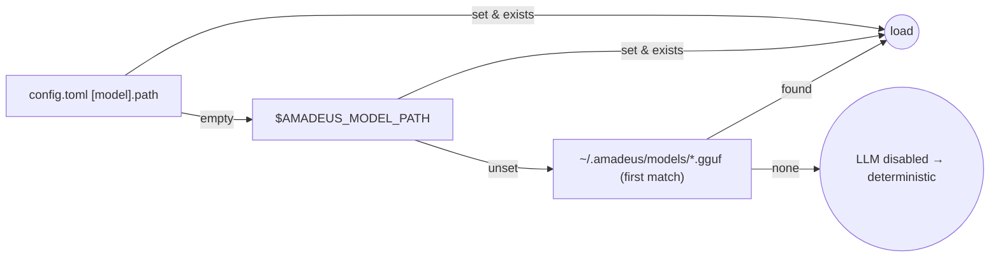
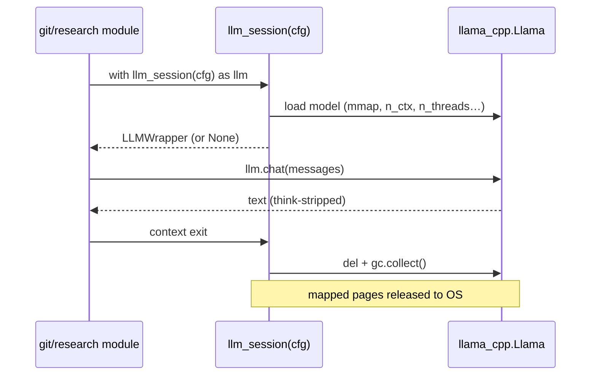
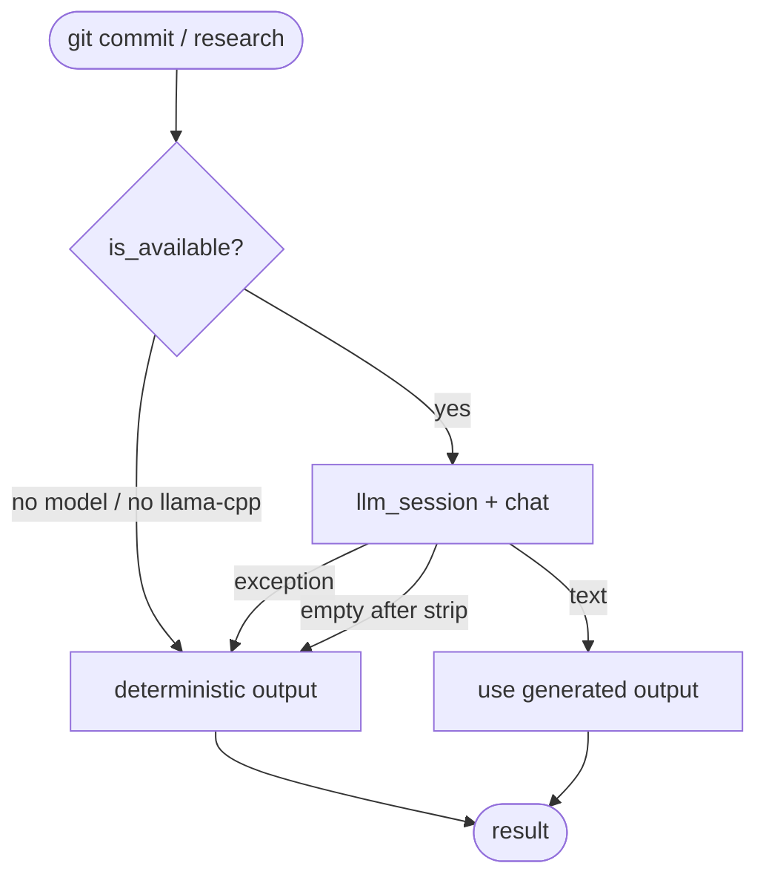

# AI & the Local LLM

Amadeus is deterministic-first: the LLM is **optional**, **local**, and
**short-lived**. This document explains when the model runs, how it is loaded and
released, how prompts are constructed, and how reasoning models are handled.

## When the LLM Runs

Only two commands use the model, and both degrade gracefully without it:

| Command | LLM role | Fallback when unavailable |
| --- | --- | --- |
| `amadeus git commit` | Author a Conventional Commit message from the diff | Deterministic template (`type(scope): update files`) |
| `amadeus research <topic>` | Summarize extracted sources into a report | Deterministic stitched report of raw excerpts |

Everything else (dashboard, tasks, notes, search, status, cleanup) never touches
the model.

## Model Discovery

When `[model].path` is empty, Amadeus resolves a model in this order:



Implementation: `_discover_model()` in
[`amadeus/core/config.py`](../amadeus/core/config.py). The simplest setup is to
drop or symlink a GGUF into `~/.amadeus/models/`.

```bash
mkdir -p ~/.amadeus/models
ln -s /path/to/model.gguf ~/.amadeus/models/
amadeus config | grep model.path
```

## Lifecycle: Load → Use → Release

The model lives only inside the `llm_session()` context manager
([`amadeus/utils/llm.py`](../amadeus/utils/llm.py)).



Key load parameters (from `[model]` config):

| Param | Default | Effect |
| --- | --- | --- |
| `n_ctx` | 2048 | Context window; bounds prompt + reply |
| `n_threads` | 0 (auto) | CPU threads for inference |
| `n_batch` | 256 | Prompt-eval batch size |
| `max_tokens` | 384 | Generation cap per call |
| `temperature` | 0.4 | Sampling randomness |

The model is loaded with `use_mmap=True`, `use_mlock=False`, and a fixed
`seed=42` for reproducibility.

## Prompt Construction

Amadeus uses the **chat API** (`LLMWrapper.chat`), not raw completion, so that
`llama-cpp-python` applies the model's built-in chat template. Raw completion on
an instruct model produces poor output.

### Commit Messages

A system/user message pair (`git_assist.py`):

```text
system: You write Conventional Commits messages. Produce ONE message in the form
        `type(scope): imperative summary`… Reply with only the commit message —
        no preamble, no code fences, no commentary. /no_think
user:   Diff:
        ```diff
        <truncated diff, ≤ 4000 chars>
        ```
        Files changed:
        <up to 30 paths>
```

### Research Summaries

```text
system: You are a research assistant. Write a structured Markdown report with
        the sections `## Summary`, `## Key Points`, and `## Sources`. Synthesise
        only what the excerpts contain — do not invent facts…
user:   Topic: <topic>

        Excerpts from web sources:
        <concatenated, ≤ 6000 chars to fit n_ctx>
```

> Excerpts are capped so the prompt plus reply fits the low-RAM `n_ctx=2048`
> window. Raising `n_ctx` allows larger inputs at a RAM cost.

## Reasoning Models (Qwen3-class)

Modern small models often emit a `<think>…</think>` chain-of-thought before the
answer. Amadeus handles this in two ways:

1. **`/no_think` directive** — appended to the commit system prompt to suppress
   reasoning for terse, fast output.
2. **`strip_think()`** — removes reasoning from all model output, covering three
   shapes:

   ```mermaid
   flowchart TD
     In[raw model output] --> A["matched &lt;think&gt;…&lt;/think&gt;"]
     A --> B["leading reasoning ending in &lt;/think&gt;<br/>(template auto-opened the block)"]
     B --> C["unclosed &lt;think&gt;… (truncated)"]
     C --> Out[clean answer]
   ```

If stripping leaves an empty string (the model spent its whole budget thinking),
the command falls back to deterministic output.

## Graceful Degradation



`is_available(cfg)` returns `True` only when **both** a model file exists **and**
`llama-cpp-python` is importable. Any inference exception is caught and falls back
with a warning — a missing or broken model never breaks the command.

## Tuning for Low-RAM Machines

| Goal | Adjust |
| --- | --- |
| Less RAM | Smaller model (1.5B Q4_K_M), lower `n_ctx` |
| Faster commits | Keep `/no_think`; modest `max_tokens` (256–384) |
| Better research depth | Larger `n_ctx` (e.g. 4096) and raise the excerpt cap |
| More throughput | Set `n_threads` to your physical core count |
| More deterministic text | Lower `temperature` (e.g. 0.2) |

## Choosing a Model

- Prefer **instruct/chat** GGUF variants (they carry a chat template).
- Q4_K_M is a good size/quality trade-off for CPU inference.
- 1.5B–3B parameter models suit 4 GB machines; larger models need more RAM than
  the low-RAM target assumes.

```bash
huggingface-cli download Qwen/Qwen2.5-1.5B-Instruct-GGUF \
    qwen2.5-1.5b-instruct-q4_k_m.gguf \
    --local-dir ~/.amadeus/models/
```

## Privacy

All inference is **offline**. No prompts, diffs, or notes leave your machine. The
only network activity in the AI-adjacent path is the research **fetch** step
(downloading public web pages), which is unrelated to inference.

## See Also

- [caching.md](caching.md#llm-weight-lifetime) — why weights are not kept resident.
- [performance.md](performance.md) — measured load and inference timings.
- [configuration.md](configuration.md#model) — every model option.
- [architecture.md](architecture.md#ai-pipeline) — the pipeline in context.
