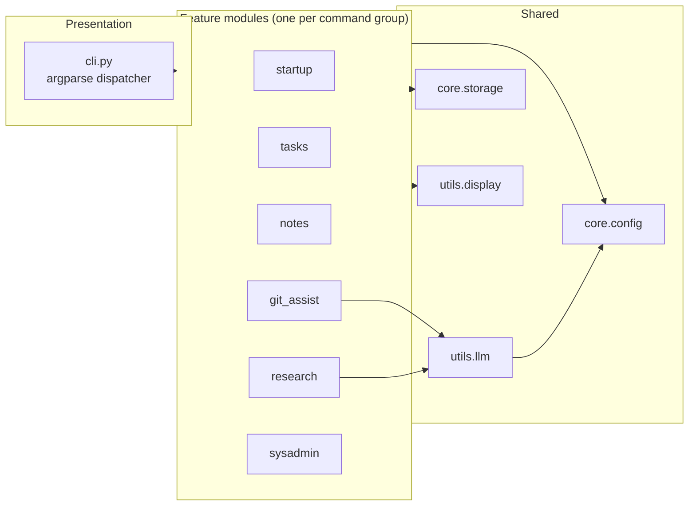
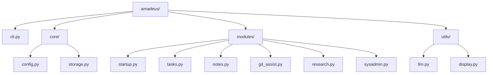
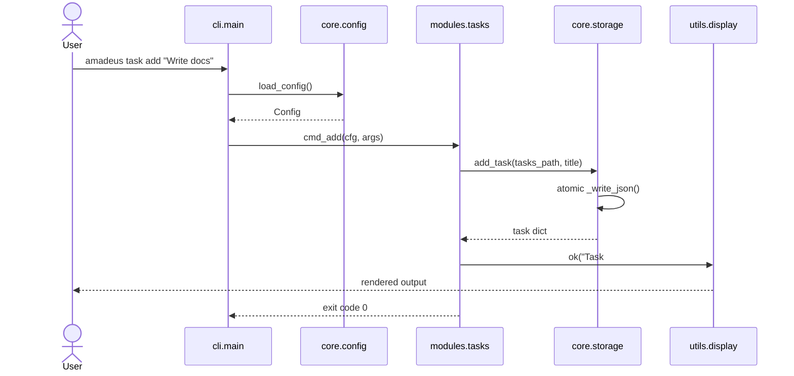
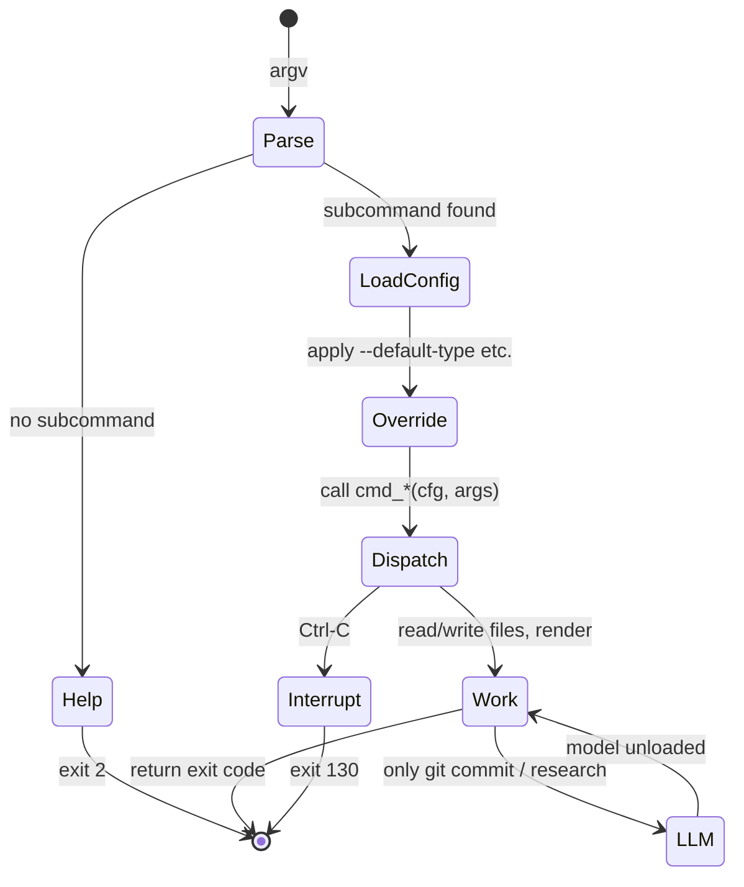
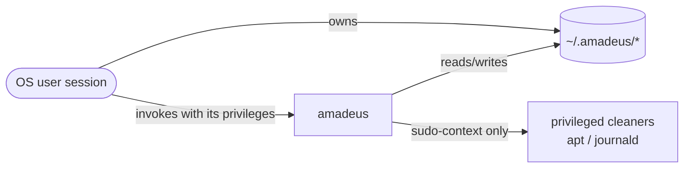
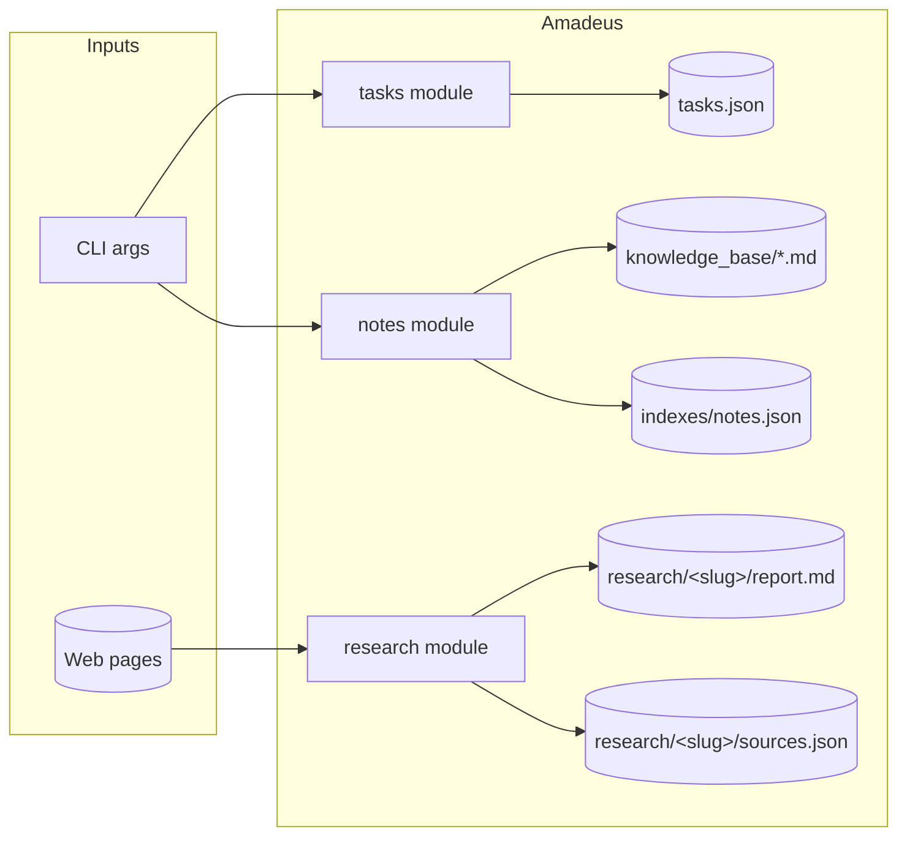
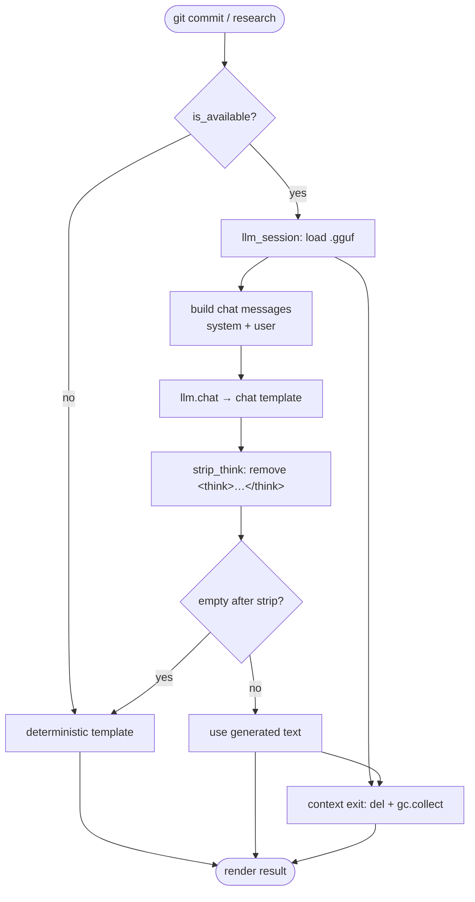
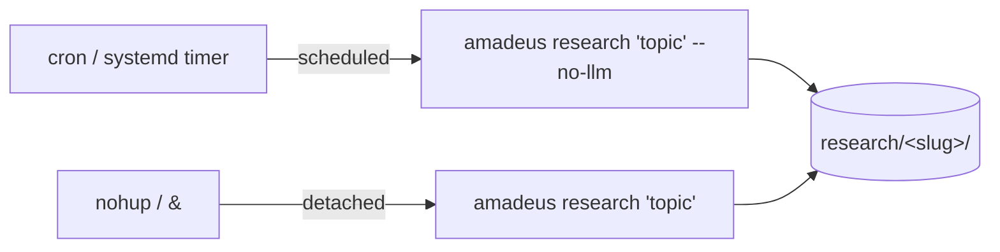
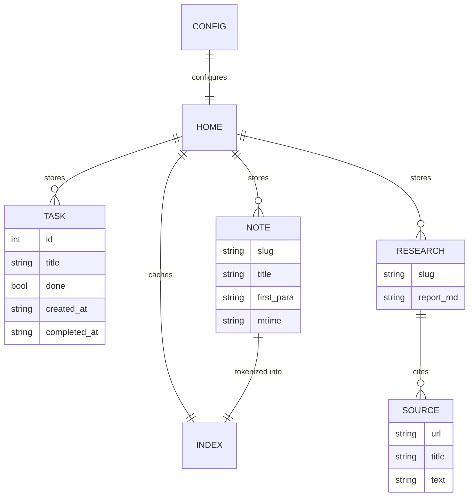
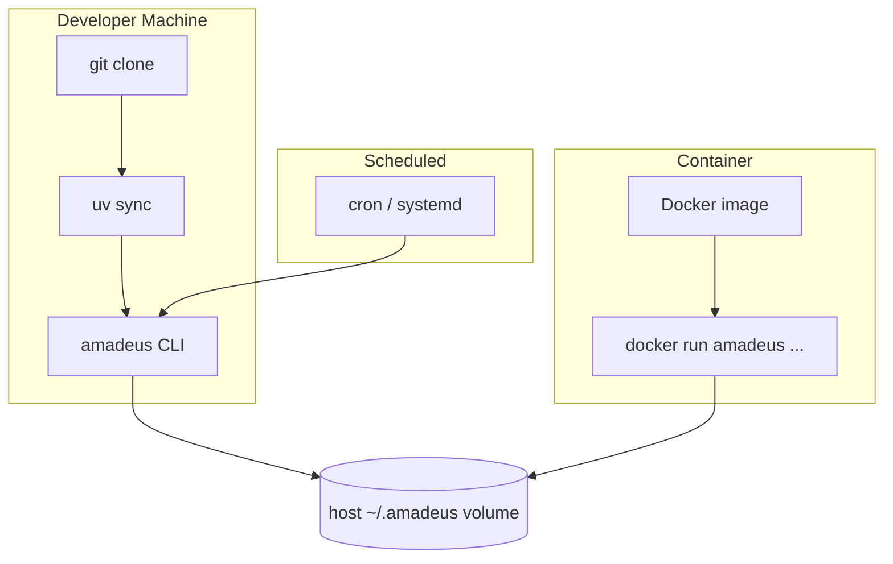

# Architecture

This document explains how Amadeus is structured, how a command flows through
the system, and how the optional AI pipeline works.

## System Overview

Amadeus is a **stateless CLI dispatcher**. There is no daemon, server, database
engine, or message queue. Every invocation:

1. Parses arguments (`argparse`).
2. Loads configuration once (`core.config`).
3. Dispatches to exactly one feature module.
4. Reads/writes plain files (`core.storage`) and renders output (`utils.display`).
5. Optionally loads a local LLM for a single step (`utils.llm`), then unloads it.
6. Exits, returning memory to the OS.

```mermaid
flowchart TD
    subgraph Shell
      U([User]) -->|amadeus task add "x"| E[entry point<br/>amadeus = cli:main]
    end
    E --> P[argparse parser]
    P --> L[load_config]
    P --> D{dispatch by subcommand}
    D --> M1[modules.startup]
    D --> M2[modules.tasks]
    D --> M3[modules.notes]
    D --> M4[modules.git_assist]
    D --> M5[modules.research]
    D --> M6[modules.sysadmin]
    D --> M7[cli.cmd_config]
    M1 & M2 & M3 & M4 & M5 & M6 & M7 --> S[core.storage]
    M1 & M2 & M3 & M4 & M5 & M6 & M7 --> V[utils.display]
    M4 & M5 -. on demand .-> A[utils.llm.llm_session]
    A -. mmap load/unload .-> G[(local .gguf)]
    S --> FS[(~/.amadeus files)]
```

## High-Level Architecture

The codebase is organized into three layers with a strict dependency direction:
modules depend on core and utils, never the reverse.



This is a lightweight take on **Clean Architecture**: the feature modules are use
cases, `core` holds entities and persistence, and `utils` provides infrastructure
adapters (terminal I/O, model runtime). Dependencies point inward toward `core`.

## Folder Responsibilities

| Path | Responsibility |
| --- | --- |
| `amadeus/cli.py` | Build the argument parser, load config, dispatch, map exit codes |
| `amadeus/core/config.py` | Load/validate `config.toml`; model auto-discovery; typed `Config` dataclasses |
| `amadeus/core/storage.py` | All file I/O: tasks JSON, Markdown notes, research output, index cache, atomic writes, `slugify` |
| `amadeus/modules/startup.py` | `amadeus start` — compose the daily dashboard |
| `amadeus/modules/tasks.py` | `amadeus task …` — task CRUD |
| `amadeus/modules/notes.py` | `amadeus learn …` — note CRUD + BM25L search + index cache |
| `amadeus/modules/git_assist.py` | `amadeus git …` — porcelain parsing, commit message generation |
| `amadeus/modules/research.py` | `amadeus research …` — search, fetch, extract, summarize |
| `amadeus/modules/sysadmin.py` | `amadeus sys …` — metrics + allow-listed cleanup |
| `amadeus/utils/llm.py` | Lazy LLM lifecycle (`llm_session`), `strip_think`, availability checks |
| `amadeus/utils/display.py` | Rich console: tables, panels, prompts, colour rules |



## Component Relationships

A representative command, `amadeus task add`, exercises the common path:



## Request (Command) Lifecycle



Exit codes follow a simple convention:

| Code | Meaning |
| --- | --- |
| `0` | Success |
| `1` | Operation failed (e.g. not a git repo, no results) |
| `2` | Usage error / missing required argument |
| `130` | Interrupted (Ctrl-C) |

## Authentication Flow

Amadeus is a **single-user local tool** with no authentication subsystem. The
trust boundary is the operating-system user account; authorization is delegated
to filesystem permissions and the privileges of the invoking shell.



See [authentication.md](authentication.md) for the full trust model.

## Data Flow

Persistence is plain files. No ORM, no migrations.



Details and schemas: [database.md](database.md).

## AI Pipeline

The LLM is loaded only inside `utils.llm.llm_session()` and released on context
exit. Two commands use it; both fall back to deterministic output if a model is
unavailable.



The full pipeline, prompts, and reasoning-model handling are in [ai.md](ai.md).

## Background Jobs & Event Flow

Amadeus has **no built-in background jobs, scheduler, or event bus** — this is a
deliberate design decision to keep the idle footprint at zero. Unattended work is
delegated to the operating system:



There is no message queue, no pub/sub, and no inter-process communication. Each
scheduled invocation is fully independent.

## Caching Strategy

Two distinct "caches" exist, with different lifetimes:

| Cache | Location | Lifetime | Invalidation |
| --- | --- | --- | --- |
| BM25 index | `~/.amadeus/indexes/notes.json` | Persistent | Per-file MD5 change |
| LLM weights | Process RSS (mmap) | One `llm_session` | Released on context exit |

See [caching.md](caching.md).

## Database Design

There is no database server. The "database" is a directory of human-readable
files. The conceptual entity relationships:



Full schemas and file formats: [database.md](database.md).

## Deployment Architecture

Because Amadeus is a local CLI, "deployment" means reproducible distribution and
unattended invocation, not a running service.



See [deployment.md](deployment.md).

## Design Principles Recap

- **Deterministic-first** — the LLM is optional and short-lived.
- **Stateless** — no daemon; the OS reclaims memory on exit.
- **Plain files** — portable, greppable, backup-friendly storage.
- **Separation of concerns** — modules are use cases; `core`/`utils` are shared.
- **Fail safe** — atomic writes, allow-lists, confirmations, dry-runs.
