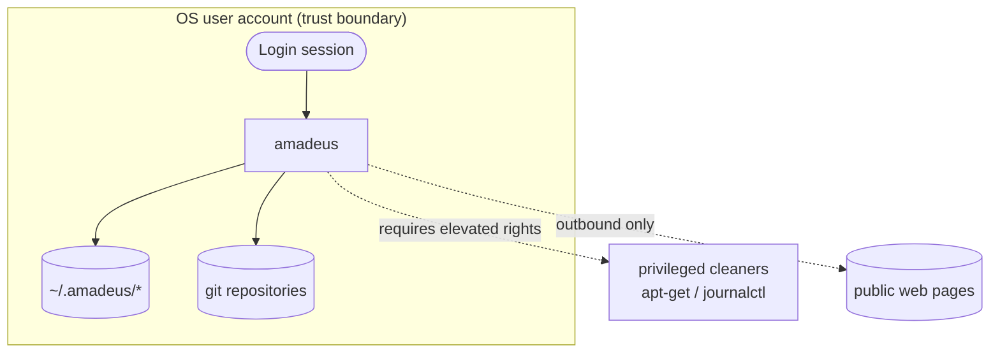

# Authentication & Authorization

> **Scope note:** Amadeus has **no authentication subsystem** — no accounts, no
> passwords, no API keys, no tokens, no sessions. It is a single-user local tool.
> This document explains the **trust model** that takes the place of
> authentication, and why that is the correct design for this application.

## Trust Model

The security boundary is the **operating-system user account**. Whoever can run
the `amadeus` binary already has the privileges of that account, and all of
Amadeus's data lives in files owned by that account.



- **Identity** = the Unix/Windows user running the command.
- **Authorization** = filesystem permissions on `~/.amadeus/` and on any git
  repository you point Amadeus at.
- **Elevation** = `amadeus sys clean` may invoke privileged tools (`apt-get`,
  `journalctl`); those succeed only if the invoking user has the rights, exactly
  as if run manually.

## Why No Auth?

| Concern | Resolution |
| --- | --- |
| Multi-user access | Not supported by design; one user per home directory |
| Remote access | None — no network listener exists |
| Credential storage | None required; nothing to authenticate against |
| Service-to-service auth | N/A — no services |

Adding authentication would imply a server, a credential store, and a larger
attack surface — all contrary to the project's local-first, low-footprint goals.

## Authorization in Practice

Amadeus relies entirely on the host OS for access control:

```bash
# Restrict your knowledge base and tasks to your account only:
chmod 700 ~/.amadeus
chmod -R go-rwx ~/.amadeus
```

For the git assistant, Amadeus operates on whatever repository your current
working directory belongs to — it cannot act on repositories you cannot already
access.

## External Service Credentials

- **Web research** uses unauthenticated public endpoints (DuckDuckGo HTML, then
  the result pages). No API keys are used or stored.
- **Model download** (e.g. `huggingface-cli`) is performed by **you**, outside
  Amadeus, using your own credentials if needed. Amadeus only reads the resulting
  local `.gguf` file.

## If You Need Auth

If you wrap Amadeus in automation that *does* require secrets (for example,
fetching models from a private registry), keep those secrets in your shell
environment or a secrets manager and never commit them. See
[security.md](security.md#secrets-management).

## Related

- [security.md](security.md) — full threat model and secure-coding practices.
- [architecture.md](architecture.md#authentication-flow) — the trust-boundary
  diagram in context.
- [SECURITY.md](../SECURITY.md) — vulnerability reporting.
