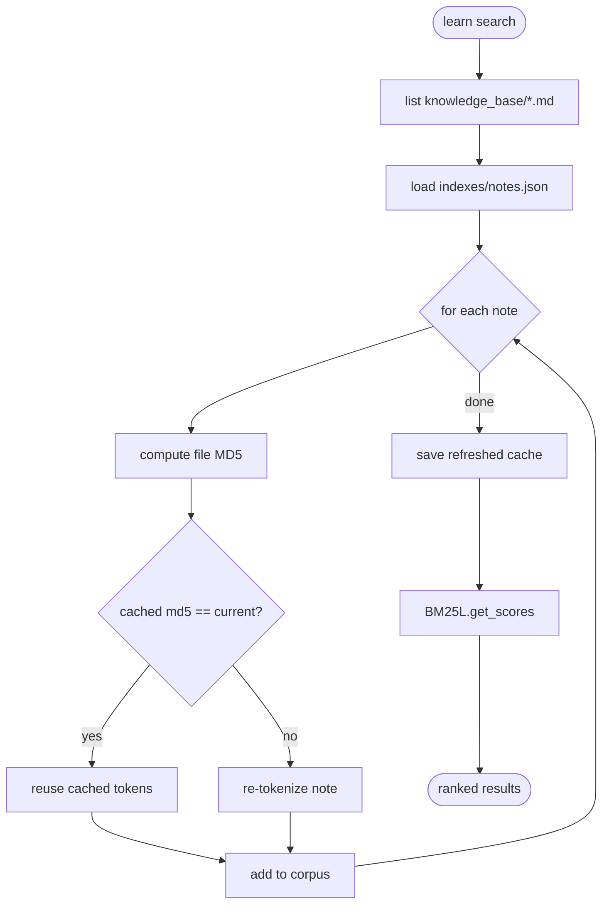
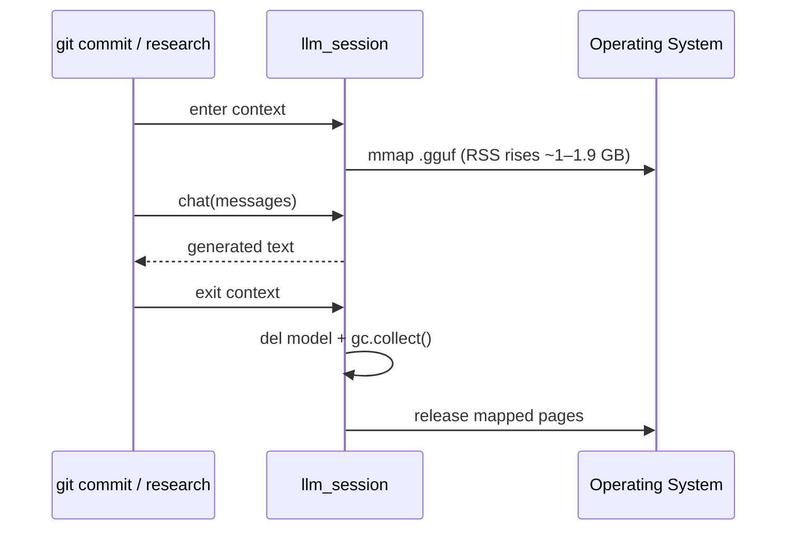

# Caching

Amadeus uses two caches with very different lifetimes and purposes. Neither is a
network cache or a cache server — both are local and dependency-free.

| Cache | Backing store | Lifetime | Invalidation | Purpose |
| --- | --- | --- | --- | --- |
| BM25 index cache | `~/.amadeus/indexes/notes.json` | Persistent | Per-file MD5 change | Avoid re-tokenizing unchanged notes |
| LLM weight "cache" | Process memory (mmap) | One `llm_session` | Released on context exit | Hold model weights during inference |

## BM25 Index Cache

`amadeus learn search` ranks notes with BM25L. Tokenizing every note on every
search is wasteful once a corpus grows, so Amadeus caches each note's tokens
keyed by its content MD5.

### How It Works



Implementation: `_load_or_build_index()` in
[`amadeus/modules/notes.py`](../amadeus/modules/notes.py), backed by
`load_index_cache` / `save_index_cache` / `file_md5` in
[`amadeus/core/storage.py`](../amadeus/core/storage.py).

### Cache Entry Shape

```json
{
  "files": {
    "/home/me/.amadeus/knowledge_base/rust-ownership.md": {
      "md5": "0c1f5e…",
      "tokens": ["rust", "ownership", "borrow", "checker"]
    }
  }
}
```

### Properties

- **Deterministic** — identical inputs always produce identical rankings.
- **Self-healing** — editing a note changes its MD5, so its tokens are refreshed
  on the next search; deleted notes simply drop out of the rebuilt cache.
- **Cheap** — a few hundred KB for hundreds of notes; no embeddings, no PyTorch.

### Managing the Cache

The cache is safe to delete; it is rebuilt on the next search.

```bash
rm ~/.amadeus/indexes/notes.json   # force a full re-tokenize next search
```

### Why BM25L (not embeddings)?

| Aspect | BM25L | Vector embeddings |
| --- | --- | --- |
| Determinism | ✅ exact, repeatable | ⚠️ model/version dependent |
| Dependencies | `rank-bm25` only | PyTorch + `sentence-transformers` |
| RAM | Tens–hundreds of KB | Hundreds of MB to GB |
| Cold start | Milliseconds | Seconds (model load) |

BM25L (rather than plain BM25Okapi) avoids the small-corpus IDF quirk where
scores collapse toward zero. This matters for a personal knowledge base that may
contain only a handful of notes.

## LLM Weight Lifetime

The model is the only multi-GB resource. It is **not** a persistent cache by
design — keeping weights resident is precisely the behaviour Amadeus avoids.



- Loaded with `use_mmap=True`, so the OS page cache can keep the file warm across
  runs (which is why a second load is faster — see [performance.md](performance.md)).
- Explicitly dropped and garbage-collected on context exit to return resident
  pages to the OS.

> **Operational tip:** repeated LLM commands in quick succession each pay the
> load cost. If you have many to do, batch them; there is intentionally no
> persistent model server (see [ROADMAP.md](../ROADMAP.md) for the planned
> optional backend).

## What Amadeus Does *Not* Cache

- **Web research results** — every `amadeus research` run fetches fresh pages.
  Result caching is a roadmap item.
- **System metrics** — `sys status` and `start` read live values each run.
- **Config** — re-read from disk on every invocation (it is tiny).

## See Also

- [database.md](database.md) — on-disk formats.
- [ai.md](ai.md) — the model lifecycle in depth.
- [performance.md](performance.md) — measured load/search timings.
