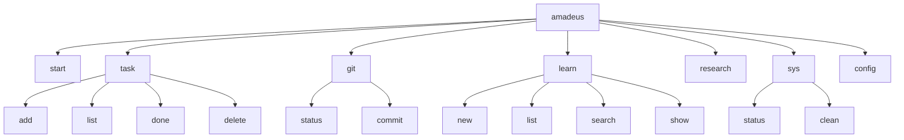

# CLI Reference

The complete command-line interface for Amadeus. The single entry point is
`amadeus`; each command group has its own subcommands. Run `amadeus <group>
--help` for inline help.

## Synopsis

```text
amadeus [--version] <command> [<args>]
```

| Global flag | Description |
| --- | --- |
| `-h`, `--help` | Show help for the program or a subcommand |
| `--version` | Print the version and exit |

## Command Map



## Exit Codes

| Code | Meaning |
| --- | --- |
| `0` | Success |
| `1` | Operation failed (e.g. not a git repo, no results, missing id) |
| `2` | Usage error / missing required argument |
| `130` | Interrupted (Ctrl-C) |

---

## `amadeus start`

Render the daily dashboard: system snapshot, today's open tasks, and per-project
git status (for paths in `[paths].projects`).

```bash
amadeus start
```

No arguments. Always exits `0`.

---

## `amadeus task`

Manage tasks stored in `~/.amadeus/tasks.json`.

### `task add <title>`

```bash
amadeus task add "Write the CLI reference"
```

| Argument | Required | Description |
| --- | --- | --- |
| `title` | yes | Task title |

Exit: `0` on success, `2` if the title is missing.

### `task list [--all]`

```bash
amadeus task list          # open tasks only
amadeus task list --all    # include completed
```

| Flag | Description |
| --- | --- |
| `--all` | Include completed tasks |

### `task done <id>`

```bash
amadeus task done 1
```

| Argument | Type | Description |
| --- | --- | --- |
| `id` | int | Task id to complete |

Exit: `0` on success, `1` if no task with that id.

### `task delete <id>`

```bash
amadeus task delete 1
```

Exit: `0` on success, `1` if no task with that id.

---

## `amadeus git`

Git assistance for the repository in the current working directory.

### `git status`

A grouped, colour-coded view of `git status --porcelain` plus `git diff --stat`.

```bash
amadeus git status
```

Exit: `0` (clean or dirty), `1` if not inside a git repository.

### `git commit`

Propose a commit message from the diff, confirm, then commit.

```bash
amadeus git commit                       # propose → confirm → commit
amadeus git commit -y                     # accept automatically
amadeus git commit --no-stage             # do not run `git add -A`
amadeus git commit --default-type feat    # override fallback type
```

| Flag | Description |
| --- | --- |
| `-y`, `--yes` | Skip the confirmation prompt |
| `--no-stage` | Do not stage changes before committing |
| `--default-type <type>` | Conventional Commit type for the deterministic fallback |

Behaviour:

- Uses the local LLM if available; otherwise a deterministic template.
- Staging (`git add -A`, when `auto_stage` is on) happens **only after** you
  accept the message — aborting leaves your index untouched.
- At the prompt, choose `y` (accept), `e` (edit), or `n` (abort).

Exit: `0` committed, `1` aborted/failed or not a repo.

---

## `amadeus learn`

Manage the Markdown knowledge base in `~/.amadeus/knowledge_base/`.

### `learn new <title>`

```bash
# Interactive (opens $EDITOR):
amadeus learn new "BM25 vs embeddings"

# Non-interactive:
amadeus learn new "BM25 vs embeddings" --no-edit --body "# BM25 vs embeddings

BM25L is deterministic."
```

| Argument / flag | Description |
| --- | --- |
| `title` | Note title (slugified to the filename) |
| `--body <text>` | Provide the body non-interactively |
| `--no-edit` | Do not open `$EDITOR` |
| `--force` | Overwrite an existing note with the same slug |

Exit: `0` created, `1` if the note exists and `--force` was not given, `2` if the
title is missing.

### `learn list`

```bash
amadeus learn list
```

Lists all notes with title, first paragraph, and modified time.

### `learn search <query>`

Deterministic BM25L ranking across all notes.

```bash
amadeus learn search "borrow checker"
```

| Argument | Description |
| --- | --- |
| `query` | Search terms (stopwords removed) |

Exit: `0` (results or none), `2` if the query is missing. Results with a
non-positive score are excluded; up to 10 are shown.

### `learn show <slug>`

```bash
amadeus learn show bm25-vs-embeddings
```

Prefers an exact `<slug>.md`; warns and exits `1` on an ambiguous prefix.

| Argument | Description |
| --- | --- |
| `slug` | Note slug (exact preferred; prefix allowed if unambiguous) |

---

## `amadeus research <topic>`

Search the web, extract text, optionally summarize with the LLM, and save a
report under `~/.amadeus/research/<slug>/`.

```bash
amadeus research "rust ownership model"
amadeus research "rust ownership model" --no-llm   # deterministic report
```

| Argument / flag | Description |
| --- | --- |
| `topic` | Research topic / query |
| `--no-llm` | Skip the LLM; stitch raw excerpts into a deterministic report |

Outputs `report.md` and `sources.json`. Honours `[research].max_pages` and
`[research].fetch_timeout`.

Exit: `0` on success, `1` if no results or no extractable text, `2` if the topic
is missing.

---

## `amadeus sys`

System monitoring and maintenance.

### `sys status`

```bash
amadeus sys status
```

Reports CPU load, RAM, disk, battery, and the top processes by memory.

### `sys clean [--dry-run]`

```bash
amadeus sys clean --dry-run    # report only, delete nothing
amadeus sys clean              # perform cleanup
```

| Flag | Description |
| --- | --- |
| `--dry-run` | Report what would be freed without deleting |

Only allow-listed categories are cleaned (`apt-archives`, `apt-lists`,
`tmp-amadeus`, `journal`); unrecognized targets are skipped with a warning.
Privileged cleaners require appropriate rights. See
[security.md](security.md#system-cleanup).

---

## `amadeus config`

Inspect the effective configuration.

```bash
amadeus config          # render all settings as a table
amadeus config --path   # print the config file path (plain, scriptable)
```

| Flag | Description |
| --- | --- |
| `--path` | Print `~/.amadeus/config.toml` and exit |

---

## Tips

- Combine with the shell: `amadeus learn search "x" || echo "no match ($?)"`.
- For automation, prefer reading the JSON/Markdown files directly (see
  [database.md](database.md)) over parsing rendered tables.
- Set `[paths].projects` to make `amadeus start` summarize multiple repos at once.

See [examples.md](examples.md) for end-to-end workflows.
