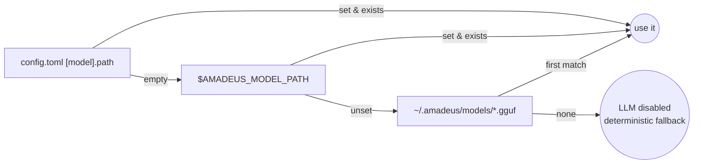

# Configuration

Amadeus reads a single TOML file at `~/.amadeus/config.toml`. It is created with
defaults on first run and **never overwritten** afterwards — edit it by hand.

```bash
amadeus config          # show the effective configuration
amadeus config --path   # print the config file location
```

The loader lives in [`amadeus/core/config.py`](../amadeus/core/config.py). Values
are coerced to typed dataclasses; unknown keys are ignored.

## File Location

| What | Path |
| --- | --- |
| Config file | `~/.amadeus/config.toml` |
| Home directory | `~/.amadeus/` |

The home directory can be redirected in tests and embedding scenarios by passing
an explicit path to `load_config(path)`, but the CLI always uses `~/.amadeus/`.

## Full Reference

### `[user]`

| Key | Type | Default | Description |
| --- | --- | --- | --- |
| `name` | string | `"Amadeus User"` | Greeting name in `amadeus start` |

```toml
[user]
name = "Ada"
```

### `[paths]`

| Key | Type | Default | Description |
| --- | --- | --- | --- |
| `projects` | string[] | `[]` | Project roots scanned for git status by `amadeus start` |

```toml
[paths]
projects = ["~/projects/amadeus", "~/work/api"]
```

Paths support `~` expansion. Non-existent paths are reported as `missing` rather
than failing the dashboard.

### `[model]`

| Key | Type | Default | Description |
| --- | --- | --- | --- |
| `path` | string | `""` | GGUF model path; empty triggers auto-discovery |
| `n_ctx` | int | `2048` | Context window (tokens). Caps prompt + reply size |
| `n_threads` | int | `0` | Inference threads; `0` = auto-detect physical cores |
| `n_batch` | int | `256` | Batch size for prompt evaluation |
| `max_tokens` | int | `384` | Maximum tokens generated per call |
| `temperature` | float | `0.4` | Sampling temperature |

```toml
[model]
path = ""
n_ctx = 2048
n_threads = 0
n_batch = 256
max_tokens = 384
temperature = 0.4
```

Model **discovery order** when `path` is empty:



See [ai.md](ai.md) for tuning guidance on low-RAM machines.

### `[git]`

| Key | Type | Default | Description |
| --- | --- | --- | --- |
| `auto_stage` | bool | `true` | Run `git add -A` after the user accepts a commit message |
| `default_type` | string | `"chore"` | Conventional Commit type for the fallback message; `"auto"` infers from file types |

```toml
[git]
auto_stage = true
default_type = "chore"
```

> The `--default-type` CLI flag overrides this per invocation. With
> `default_type = "auto"`, the type is inferred (`docs` for Markdown, `test` for
> test files, `build` for config/build files, else `chore`).

### `[research]`

| Key | Type | Default | Description |
| --- | --- | --- | --- |
| `max_pages` | int | `5` | Maximum source pages fetched per `research` run |
| `fetch_timeout` | int | `15` | Per-request timeout (seconds) |
| `user_agent` | string | `"Mozilla/5.0 (compatible; Amadeus-Research/1.0)"` | User-Agent header |

```toml
[research]
max_pages = 5
fetch_timeout = 15
user_agent = "Mozilla/5.0 (compatible; Amadeus-Research/1.0)"
```

### `[sys]`

| Key | Type | Default | Description |
| --- | --- | --- | --- |
| `ram_warn_mb` | int | `800` | Warn (yellow) when available RAM falls below this |
| `disk_warn_gb` | int | `5` | Warn (yellow) when free disk falls below this |
| `clean_targets` | string[] | `["/var/cache/apt/archives", "/tmp/amadeus"]` | Paths eligible for `sys clean` (subject to the allow-list) |

```toml
[sys]
ram_warn_mb = 800
disk_warn_gb = 5
clean_targets = ["/var/cache/apt/archives", "/tmp/amadeus"]
```

> Only recognized categories are ever cleaned, regardless of what is listed. See
> [security.md](security.md#system-cleanup) and [cli.md](cli.md#amadeus-sys).

## Precedence

For the model path, runtime resolution is:

1. Environment / discovery (see the diagram above).
2. `config.toml` value.
3. Built-in dataclass defaults.

For everything else, `config.toml` overrides the built-in defaults; the
`--default-type` flag overrides `[git].default_type` for a single command.

## Validating Changes

After editing the file:

```bash
amadeus config   # re-reads and renders the effective values
```

A malformed TOML file will raise a parse error. Robust validation with friendly
messages is on the [roadmap](../ROADMAP.md).

## See Also

- [Environment variables](#) — documented in the [README](../README.md#environment-variables).
- [ai.md](ai.md) — model tuning.
- [database.md](database.md) — what lives under `~/.amadeus/`.
