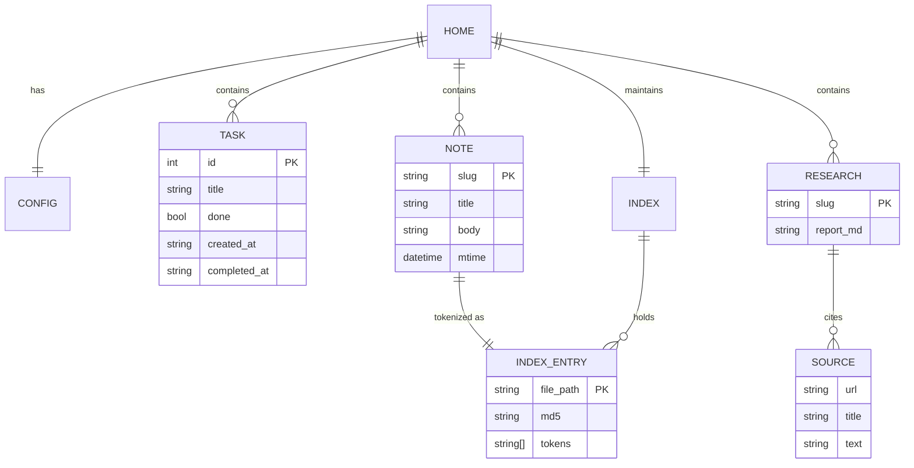

# Data Storage ("Database")

> **Scope note:** Amadeus uses **no database engine** — no SQL, no NoSQL, no
> embedded DB. Persistence is a directory of plain JSON and Markdown files under
> `~/.amadeus/`. This is deliberate: it keeps the footprint tiny and the data
> portable, greppable, and trivially backed up. This document is the schema and
> file-format reference.

## Storage Root

All state lives under `~/.amadeus/` (the "Amadeus home"). The tree is created
idempotently by `ensure_amadeus_home()` in
[`amadeus/core/config.py`](../amadeus/core/config.py).

```text
~/.amadeus/
├── config.toml              # user configuration (TOML)
├── tasks.json               # task list (JSON)
├── knowledge_base/          # one Markdown file per note
│   └── <slug>.md
├── research/                # research outputs
│   └── <slug>/
│       ├── report.md        # the report (Markdown)
│       └── sources.json     # extracted sources (JSON)
├── indexes/                 # BM25 token cache
│   └── notes.json
└── models/                  # discovered GGUF model files
    └── <model>.gguf
```

## Entity Relationships



All I/O is centralized in [`amadeus/core/storage.py`](../amadeus/core/storage.py).

## File Formats

### `tasks.json`

A single object with a `tasks` array. Written atomically.

```json
{
  "tasks": [
    {
      "id": 1,
      "title": "Write the database doc",
      "done": false,
      "created_at": "2026-06-26T22:38:43",
      "completed_at": null
    },
    {
      "id": 2,
      "title": "Review research report",
      "done": true,
      "created_at": "2026-06-25T09:10:00",
      "completed_at": "2026-06-26T18:02:11"
    }
  ]
}
```

| Field | Type | Notes |
| --- | --- | --- |
| `id` | int | Monotonic; `max(existing)+1` |
| `title` | string | Free text |
| `done` | bool | Completion flag |
| `created_at` | string | ISO-8601, seconds precision |
| `completed_at` | string\|null | Set when completed |

> A corrupt or unparseable `tasks.json` is treated as empty rather than crashing
> (`load_tasks` returns `[]`).

### `knowledge_base/<slug>.md`

One Markdown file per note; the filename is `slugify(title) + ".md"`. The
template created by `learn new` (without `--body`):

```markdown
# <Title>

_Created: 2026-06-26T22:40:00_

## Summary

-

## Notes

-
```

Note metadata is derived on read by `parse_note_metadata`:

| Derived field | Source |
| --- | --- |
| `title` | First `# ` heading, else the slug |
| `first_para` | First prose paragraph (headers/metadata skipped), capped at 200 chars |
| `mtime` | File modification time (ISO-8601) |
| `size` | File size in bytes |

### `indexes/notes.json`

The BM25 token cache. Keyed by absolute note path; stores the file's MD5 and its
tokenized form so unchanged notes are not re-tokenized.

```json
{
  "files": {
    "/home/me/.amadeus/knowledge_base/rust-ownership.md": {
      "md5": "0c1f…",
      "tokens": ["rust", "ownership", "borrow", "checker", "memory", "safety"]
    }
  }
}
```

Invalidation is per-file: if the stored MD5 differs from the current file MD5,
that note is re-tokenized. See [caching.md](caching.md).

### `research/<slug>/report.md`

The generated (LLM or deterministic) Markdown report for a research topic.

### `research/<slug>/sources.json`

The extracted sources backing a report.

```json
[
  {
    "url": "https://example.com/rust-ownership",
    "title": "Understanding Ownership",
    "text": "Rust uses ownership and a borrow checker to guarantee memory safety…"
  }
]
```

| Field | Type | Notes |
| --- | --- | --- |
| `url` | string | Source URL |
| `title` | string | Extracted `<title>`/`<h1>` |
| `text` | string | Cleaned main text (boilerplate stripped, capped) |

### `config.toml`

Documented in full in [configuration.md](configuration.md).

## Durability & Concurrency

| Concern | Behaviour |
| --- | --- |
| Atomicity | JSON writes use a temp file + `os.replace()` (`_write_json`) — no half-written files |
| Corruption tolerance | `tasks.json` parse errors degrade to empty rather than crashing |
| Concurrency | Single-user, single-process expectation; no locking. Avoid concurrent writers |
| Encoding | UTF-8 throughout |

## Backup, Restore & Migration

Because state is plain files, ordinary tools work:

```bash
# Backup
tar czf amadeus-$(date +%F).tar.gz -C "$HOME" .amadeus

# Restore
tar xzf amadeus-2026-06-26.tar.gz -C "$HOME"

# Version control just your knowledge & tasks
cd ~/.amadeus && git init && git add knowledge_base tasks.json && git commit -m "snapshot"
```

There are no schema migrations to run; formats are additive and backward-tolerant.

## Why Not a Real Database?

| Requirement | Plain files | SQLite/Postgres |
| --- | --- | --- |
| Tiny footprint | ✅ | ⚠️ extra dependency / server |
| Human-readable | ✅ grep/diff/edit | ❌ binary/opaque |
| Portable backups | ✅ `cp`/`tar` | ⚠️ dump/restore |
| Deterministic search | ✅ BM25L over tokens | ✅ but heavier |
| Multi-writer concurrency | ❌ | ✅ |

For a single-user, low-RAM assistant, plain files win on every axis that matters
here. Multi-writer concurrency is explicitly out of scope (see [ROADMAP.md](../ROADMAP.md)).
