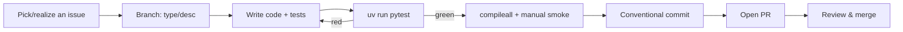
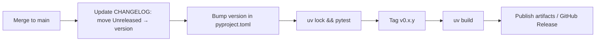

# Development Guide

This guide covers local setup, the development workflow, coding standards, and
the release process.

## Local Setup

```bash
git clone https://github.com/adityatawde9699/Amadeus-chat.git
cd Amadeus-chat
uv sync --extra dev --extra llm   # dev tools + optional LLM
uv run pytest                      # establish a green baseline
```

If you do not use `uv`:

```bash
python3.12 -m venv .venv && source .venv/bin/activate
pip install -e ".[dev,llm]"
pytest
```

## Project Layout

See [architecture.md](architecture.md#folder-responsibilities) for the full
map. The rules that matter when adding code:

- One feature area per module in `amadeus/modules/`, exposing `cmd_*(cfg, args)`
  functions that return an `int` exit code.
- All file I/O goes through `amadeus/core/storage.py`.
- All terminal output goes through `amadeus/utils/display.py` (never import
  `rich` directly in a module).
- The LLM is loaded only inside `amadeus/utils/llm.py:llm_session()`.

## Development Workflow



### Adding a New Subcommand (worked example)

1. Create the module function in the relevant `amadeus/modules/<area>.py`:

   ```python
   def cmd_export(cfg: Config, args: Any) -> int:
       notes = storage.list_notes(cfg.knowledge_base_dir)
       ...
       display.ok(f"Exported {len(notes)} notes")
       return 0
   ```

2. Wire it into the parser in `amadeus/cli.py`:

   ```python
   l_export = lsub.add_parser("export", help="Export notes to HTML")
   l_export.add_argument("--out", default="export.html")
   l_export.set_defaults(func=notes.cmd_export)
   ```

3. Add tests under `tests/` using the `cfg` fixture (isolated temp home).
4. Update [cli.md](cli.md) and the `CHANGELOG.md` `[Unreleased]` section.

## Git Workflow

A feature-branch model against `main`. See [CONTRIBUTING.md](../CONTRIBUTING.md)
for the full policy.

### Branch Naming

`type/short-description`, where `type ∈ {feat, fix, docs, refactor, test, chore}`.

### Commit Conventions

[Conventional Commits](https://www.conventionalcommits.org/):

```text
<type>(<scope>): <imperative summary>
```

| Type | When |
| --- | --- |
| `feat` | New user-facing capability |
| `fix` | Bug fix |
| `docs` | Documentation only |
| `refactor` | No behaviour change |
| `perf` | Performance improvement |
| `test` | Tests only |
| `build` / `ci` | Tooling & pipelines |
| `chore` | Housekeeping |

Amadeus can author these from your diff: `amadeus git commit`.

## Coding Standards

- **Python ≥ 3.12** with `from __future__ import annotations` and type hints.
- Public functions get docstrings; comments explain **why**, not what.
- Prefer the standard library; every third-party dependency must be justified
  and, if heavy, made optional.
- Keep functions small and pure where practical; isolate side effects in
  `storage` and `display`.
- Return explicit integer exit codes from command functions.

## Formatting, Linting & Static Analysis

The project keeps tooling lightweight. Recommended (install as needed):

```bash
# Format and lint with Ruff
uvx ruff format amadeus tests
uvx ruff check amadeus tests

# Type-check with mypy (optional)
uvx mypy amadeus
```

Suggested baseline configuration (add to `pyproject.toml` if you adopt Ruff):

```toml
[tool.ruff]
line-length = 100
target-version = "py312"
```

> CI does not yet enforce linting; PRs that pass `ruff` and `mypy` are
> appreciated. See the [roadmap](../ROADMAP.md).

## Dependency Management

- `pyproject.toml` is the **single source of truth** for dependencies.
- `uv.lock` pins the full resolution; commit it with dependency changes.
- Regenerate the flat requirements file after changes:

  ```bash
  uv lock
  uv export --no-hashes --no-emit-project -o requirements.txt
  ```

- Optional extras: `llm` (inference) and `dev` (tests). Keep heavyweight
  dependencies in an extra, never in `[project.dependencies]`.

## Build Process

Amadeus is a pure-Python package built with `setuptools`:

```bash
uv build            # produces sdist + wheel in dist/
# or
python -m build
```

The console entry point is declared in `pyproject.toml`:

```toml
[project.scripts]
amadeus = "amadeus.cli:main"
```

## Release Process



1. Move `CHANGELOG.md` `[Unreleased]` entries under a new version heading with
   today's date.
2. Bump `version` in `pyproject.toml` (SemVer).
3. Run `uv lock` and `uv run pytest` — must be green.
4. Tag: `git tag -a v0.x.y -m "v0.x.y"` and push the tag.
5. Build artifacts: `uv build`.
6. Create a GitHub Release with the changelog section as the body.

## See Also

- [testing.md](testing.md) — test layout and commands.
- [architecture.md](architecture.md) — how the pieces fit.
- [CONTRIBUTING.md](../CONTRIBUTING.md) — contribution policy.
