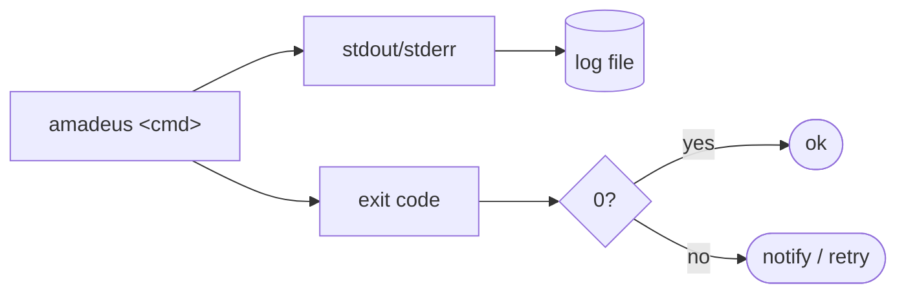

# Monitoring & Observability

> **Scope note:** Amadeus is a short-lived CLI, not a long-running service, so
> there is **no metrics endpoint, dashboard, or APM agent**. Observability means:
> (1) the system metrics Amadeus *reports about your machine*, and (2) capturing
> the output/exit codes of unattended runs. This document covers both.

## Built-in System Reporting

Amadeus itself is a monitoring tool for your machine. Two commands surface live
resource data via `psutil`.

### `amadeus sys status`

Reports CPU load, RAM, disk, battery, and the top processes by memory.

```console
$ amadeus sys status
──────────────────── System Status · 2026-06-26 22:53 ────────────────────
  CPU      Load 0.41/0.55/0.60  ·  Cores 4  ·  CPU 12.0%
  RAM      Used 61.2%  ·  Available 1.4 GB  ·  Total 3.7 GB
  Disk /   Used 74.0%  ·  Free 28.1 GB  ·  Total 117.0 GB
  Battery: 82% (on battery)
```

### `amadeus start`

The daily dashboard embeds the same snapshot alongside tasks and git status.

### Warning Thresholds

Colour-coded warnings are driven by config (see [configuration.md](configuration.md#sys)):

| Metric | Config key | Default | Behaviour |
| --- | --- | --- | --- |
| Free RAM | `sys.ram_warn_mb` | 800 MB | Yellow below threshold |
| Free disk | `sys.disk_warn_gb` | 5 GB | Yellow below threshold |

## Observing Amadeus Runs

Amadeus writes human-readable output to **stdout/stderr** and returns a meaningful
**exit code**. For interactive use that is all you need; for automation, capture
both.



### Exit Codes

| Code | Meaning |
| --- | --- |
| `0` | Success |
| `1` | Operation failed |
| `2` | Usage error |
| `130` | Interrupted |

### Logging Unattended Runs

Redirect output to a timestamped log and check the exit code:

```bash
mkdir -p ~/.amadeus/logs
LOG=~/.amadeus/logs/research-$(date +%F).log
if amadeus research "ai infra" --no-llm >"$LOG" 2>&1; then
  echo "ok" 
else
  echo "amadeus failed ($?) — see $LOG" | mail -s "Amadeus alert" you@example.com
fi
```

For `cron`/`systemd` patterns, see [deployment.md](deployment.md#unattended--scheduled-runs).

## Internal Logging

Modules use Python's `logging` (e.g. the logger `amadeus.llm`). By default the
CLI does not configure verbose handlers, so these messages are quiet. You can
enable them in a wrapper script or interactive session:

```python
import logging
logging.basicConfig(level=logging.INFO)   # surfaces amadeus.* log records
from amadeus.cli import main
main(["git", "commit", "-y"])
```

A first-class `--verbose` flag and a rotating log file under `~/.amadeus/logs/`
are on the [roadmap](../ROADMAP.md).

## Health Checks

There is no service to health-check. The equivalent "is it working?" probe is:

```bash
amadeus --version && amadeus config --path && amadeus sys status >/dev/null && echo healthy
```

In a container, use this as the command of a one-shot job rather than a liveness
probe (there is no long-running process to probe).

## Metrics for Capacity Planning

To understand resource behaviour on your hardware, run the benchmark and record
the figures over time:

```bash
uv run python scripts/benchmark.py | tee -a ~/.amadeus/logs/bench.log
```

See [performance.md](performance.md) for what each figure means.

## See Also

- [performance.md](performance.md) — measured latency and memory.
- [troubleshooting.md](troubleshooting.md) — diagnosing failures.
- [deployment.md](deployment.md) — capturing logs from scheduled runs.
