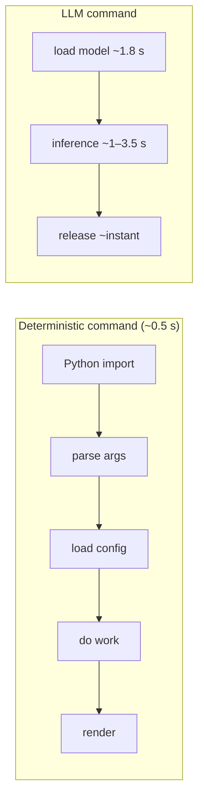

# Performance

Amadeus is engineered for low-RAM machines. This document presents **measured**
figures, explains how to reproduce them, and offers tuning guidance.

## Methodology

All numbers below come from `scripts/benchmark.py`, run on:

| Attribute | Value |
| --- | --- |
| CPU | 4 cores |
| RAM | 3.7 GB total |
| OS | Linux (kernel 6.x) |
| Python | 3.12 |
| Model | `Qwen3.5-2B.Q4_K_M.gguf` (~1.2 GB), `n_ctx=2048` |

Reproduce on your own hardware:

```bash
uv run python scripts/benchmark.py
```

The script isolates work in temporary homes so it never touches your real
`~/.amadeus`.

## Measured Results

| Metric | Measured | Notes |
| --- | --- | --- |
| Cold start (`amadeus config --path`) | ~0.57 s | Fresh process, import + dispatch |
| Cold-start peak RSS | ~50 MB | Deterministic path, no model |
| Note search (200-note corpus, warm cache) | ~40 ms | BM25L over cached tokens |
| LLM load (warm file cache) | ~1.8 s | mmap of the GGUF |
| LLM resident memory while loaded | ~1.1–1.9 GB | Released on `llm_session` exit |
| LLM commit-message completion | ~1–3.5 s | Depends on tokens generated |

> The defining property: deterministic commands stay in the **tens-of-MB** range.
> The multi-GB cost is paid **only** while a model is loaded, then returned to
> the OS.

## Where Time Goes



For deterministic commands, most of the ~0.5 s is interpreter startup and
imports (notably `rich`). For LLM commands, model load dominates unless you batch
multiple inferences (which you cannot, by design — see below).

## Tuning Guide

### Reduce Memory

| Lever | Effect |
| --- | --- |
| Smaller model (1.5B Q4_K_M) | Lower resident RAM and faster load |
| Lower `[model].n_ctx` | Smaller KV cache → less RAM |
| Avoid the `llm` extra entirely | Zero model RAM; deterministic everywhere |

### Improve LLM Speed

| Lever | Effect |
| --- | --- |
| `[model].n_threads` = physical cores | Better CPU utilization |
| Keep `/no_think` for commits | Avoids wasted reasoning tokens |
| Modest `[model].max_tokens` | Less to generate |
| Warm OS file cache | Second load is markedly faster than the first |

### Improve Search Speed

The BM25 index cache makes repeat searches fast by skipping re-tokenization of
unchanged notes. If searches are consistently slow:

- Confirm `~/.amadeus/indexes/` is writable (an unwritable cache forces re-tokenizing every time).
- Remember the **first** search after editing many notes re-tokenizes the changed
  ones; subsequent searches are fast. See [caching.md](caching.md).

## Scaling Characteristics

Amadeus does not scale by concurrency — it is a one-shot CLI. To do more work,
run more independent invocations (e.g. via `cron`). Relevant scaling factors:

| Dimension | Scales with |
| --- | --- |
| Note search | Corpus size (linear tokenization on change; cached otherwise) |
| Research | `[research].max_pages` × per-page fetch + extraction time |
| LLM throughput | `n_threads`, model size, `max_tokens` |
| Memory | Model size + `n_ctx` (only while loaded) |

## Why No Persistent Model?

Keeping the model resident would make repeated LLM commands instant, but it would
also reintroduce the ~1.5 GB idle baseline this project exists to eliminate. The
trade-off is deliberate:

| Approach | Idle RAM | Repeated LLM latency |
| --- | --- | --- |
| Persistent model (rejected) | ~1.5 GB | Fast |
| Fire-and-forget (chosen) | Tens of MB | Pays load each time |

An **optional** persistent backend (e.g. an OpenAI-compatible local server) is on
the [roadmap](../ROADMAP.md) for users who explicitly opt into the RAM cost.

## Benchmarking Over Time

Append results to a log to spot regressions across versions or hardware:

```bash
uv run python scripts/benchmark.py | tee -a ~/.amadeus/logs/bench.log
```

## See Also

- [caching.md](caching.md) — index cache and model lifetime.
- [ai.md](ai.md#tuning-for-low-ram-machines) — model tuning.
- [monitoring.md](monitoring.md) — capturing metrics from runs.
