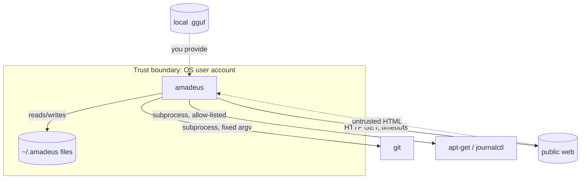
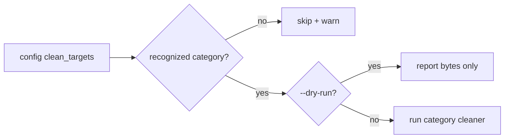

# Security

This document describes Amadeus's threat model, the safeguards built into the
code, and recommendations for running it safely. For the vulnerability-reporting
process and supported versions, see [SECURITY.md](../SECURITY.md).

## Security Posture at a Glance

| Property | Status |
| --- | --- |
| Network listener | None |
| Authentication surface | None (single-user, local) |
| Telemetry / analytics | None |
| Outbound network | Only during `amadeus research` |
| Data at rest | Plaintext files under `~/.amadeus/` |
| Privilege escalation | Only if you run privileged `sys clean` cleaners |

## Threat Model



The realistic adversary inputs are: **untrusted web content** (research),
**user-supplied paths** (cleanup), and **model files** (inference). Each has a
specific mitigation below.

## Authentication & Authorization

Amadeus has no authentication subsystem; the OS user account is the trust
boundary and filesystem permissions are the authorization mechanism. This is
covered in detail in [authentication.md](authentication.md).

## Encryption

- **In transit:** the research fetcher uses `requests`, which performs TLS
  certificate verification by default for `https://` URLs.
- **At rest:** notes, tasks, and research are stored as plaintext. Amadeus does
  not encrypt them in 0.1.x. Use filesystem permissions; optional at-rest
  encryption is on the [roadmap](../ROADMAP.md).

```bash
chmod 700 ~/.amadeus           # owner-only access to all Amadeus data
```

## Secrets Management

Amadeus requires **no secrets** to operate — there are no API keys or tokens.
The two environment variables it reads (`AMADEUS_MODEL_PATH`, `EDITOR`) are not
secret.

If your surrounding automation needs secrets (e.g. a private model registry):

- Keep them in your shell environment or a secrets manager.
- Never commit them; ensure `.env` stays git-ignored (it is, by default).
- Do not pass secrets as command-line arguments (they appear in process lists).

## API Security

There is no HTTP API, so the usual web concerns (CORS, CSRF, injection via
request bodies, rate-limit bypass) do not apply. The "API" is the CLI; its inputs
are argv and local files, scoped to your account.

## Input-Handling Safeguards

### Web Research (untrusted HTML)

| Risk | Mitigation |
| --- | --- |
| Slow/hanging servers | Per-request timeout (`[research].fetch_timeout`) |
| Resource exhaustion | Page count cap (`[research].max_pages`); extracted text is length-capped |
| Active content | HTML is parsed, never executed; `<script>`/`<style>` and other noise tags are stripped |
| Abusive crawling | Polite inter-request delay; identifiable User-Agent |

> Treat extracted text as untrusted. It is stored verbatim in `sources.json` for
> review and is never executed.

### System Cleanup (destructive)

`amadeus sys clean` is the most dangerous command, and it is constrained on
multiple levels:



- **Allow-list:** only known categories (`apt-archives`, `apt-lists`,
  `tmp-amadeus`, `journal`) are ever touched — anything else in your config is
  skipped with a warning, even if you added it deliberately.
- **Dry-run:** `--dry-run` reports what *would* be freed and deletes nothing.
- **Least privilege:** privileged cleaners only succeed if the invoking user has
  the rights; Amadeus does not self-elevate.

### Git Subprocess Execution

- Git is invoked with **fixed argument vectors** (`["git", "-C", cwd, …]`), never
  by interpolating user input into a shell string — no shell injection surface.
- `git commit` stages changes (`git add -A`) **only after** you accept the
  proposed message, so aborting leaves your index untouched.

### Local Model Files

- You choose and download the model; inference is fully offline.
- Only load GGUF files from sources you trust (e.g. official Hugging Face repos).
  A malicious model is a supply-chain risk outside Amadeus's control.

## Dependency Security

- Dependencies are pinned in `uv.lock` for reproducible installs.
- The base dependency set is small (`psutil`, `rich`, `rank-bm25`, `requests`,
  `beautifulsoup4`), reducing the audit surface; heavy ML deps are optional.
- Keep them current: `uv sync` against an updated lock. Periodically audit with a
  tool such as `pip-audit`:

  ```bash
  uvx pip-audit -r requirements.txt
  ```

## Secure Coding Practices (for contributors)

- Centralize file I/O in `core.storage` and use the **atomic** `_write_json`.
- Build subprocess commands as argument lists; never `shell=True` with user input.
- Catch and contain external failures (network, model) so they degrade rather
  than crash.
- Keep destructive operations behind allow-lists and `--dry-run`.
- Add tests asserting safety properties (e.g. dry-run deletes nothing).

## Security Recommendations (for users)

1. `chmod 700 ~/.amadeus` — restrict access to your data.
2. Review `clean_targets` and always `--dry-run` before a real `sys clean`.
3. Download models only from trusted sources.
4. Keep dependencies updated against the lockfile.
5. For unattended runs, capture logs and monitor exit codes
   ([monitoring.md](monitoring.md)).

## Reporting Vulnerabilities

Privately, per [SECURITY.md](../SECURITY.md) — do not open a public issue.
