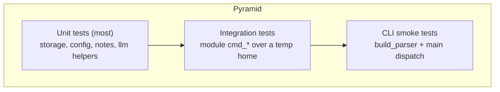

# Testing

Amadeus ships a fast, hermetic test suite: **57 tests, no network, isolated to a
temporary home directory**. Tests never touch your real `~/.amadeus`.

## Running Tests

```bash
uv sync --extra dev
uv run pytest                       # run everything (~1 s)
uv run pytest -q                    # quiet
uv run pytest tests/test_notes.py   # one file
uv run pytest -k "bm25"             # by keyword
uv run pytest -ra                   # show skip/fail reasons (default in config)
```

With `pip`: `pip install -e ".[dev]"` then `pytest`.

## Test Layout

```text
tests/
├── conftest.py          # shared fixtures (isolated home, cfg)
├── test_storage.py      # slugify, tasks, atomic writes, notes, index cache
├── test_config.py       # defaults, reload, model discovery, malformed TOML
├── test_notes.py        # tokenization, BM25L ranking, cache invalidation, commands
├── test_git_assist.py   # porcelain classification, type inference, fallback msg
├── test_research.py     # HTML extraction, DDG parsing, deterministic report
├── test_sysadmin.py     # allow-list, byte formatting, dry-run safety
├── test_llm.py          # strip_think variants, availability check
└── test_cli.py          # parser wiring + smoke dispatch
```

## What Is Covered

| Area | Representative assertions |
| --- | --- |
| Storage | Atomic write leaves no temp files; corrupt `tasks.json` → empty list |
| Config | Defaults created; model discovery order; malformed TOML raises |
| Notes/BM25 | Stopword removal; relevant note ranks first; MD5 cache invalidation |
| Git | `_classify`, `_infer_type`, fallback message scope/type |
| Research | Noise-tag stripping; `uddg=` link parsing; deterministic report content |
| Sysadmin | Target allow-list; `--dry-run` deletes nothing; real clean removes files |
| LLM helpers | `<think>` stripping (closed/unclosed/case); `is_available` false w/o model |
| CLI | Every subcommand parses with correct attrs; dispatch; exit codes |

## Test Pyramid



The suite is predominantly **unit and module-integration** tests. Because
Amadeus is a CLI with no server, "end-to-end" means invoking `main(argv)` and
asserting exit codes and rendered output — covered by `test_cli.py`.

## Fixtures & Isolation

`tests/conftest.py` provides two fixtures that keep tests hermetic:

```python
@pytest.fixture()
def home(tmp_path):
    return ensure_amadeus_home(tmp_path / ".amadeus")

@pytest.fixture()
def cfg(home):
    return load_config(home)
```

- `home` — an isolated Amadeus home under pytest's `tmp_path`.
- `cfg` — a `Config` rooted at that home.

Tests that dispatch through the CLI monkeypatch `cli.load_config` to return the
isolated `cfg`, so `main()` never reads the real config.

## Mocking Strategy

Amadeus avoids real side effects in tests:

| Boundary | Strategy |
| --- | --- |
| Filesystem | `tmp_path` only; never the real home |
| Network (research) | Pass fixture HTML strings; monkeypatch `research._fetch` |
| `subprocess` (git) | Pure parsing helpers tested directly; subprocess mocked where needed |
| LLM | Tested via `strip_think`/`is_available`; no model is loaded in CI |
| `sys clean` | Cleaners pointed at a temp dir; `--dry-run` asserted to delete nothing |

Example — network-free research parsing:

```python
def fake_fetch(url, cfg, **kw):
    return SAMPLE_HTML

monkeypatch.setattr(research, "_fetch", fake_fetch)
urls = research._ddg_search("anything", cfg)
```

## Coverage

```bash
uv run pytest --cov=amadeus --cov-report=term-missing
uv run pytest --cov=amadeus --cov-report=html   # htmlcov/index.html
```

`pytest-cov` is included in the `dev` extra. Aim to cover new behaviour with at
least one unit test plus a CLI smoke test where a command is added.

## Performance & Load Testing

Amadeus is a short-lived CLI, so "load testing" is benchmarking command latency
and memory, not concurrent request throughput. Use the benchmark script:

```bash
uv run python scripts/benchmark.py
```

It measures cold start, peak RSS, note-search latency, and LLM load/inference
time. See [performance.md](performance.md). For unattended/batch scenarios,
schedule many independent invocations (see [deployment.md](deployment.md)).

## Writing New Tests

- Use the `cfg` fixture; never hard-code `~/.amadeus`.
- Keep tests network-free and deterministic.
- Prefer testing pure helpers directly; reserve CLI smoke tests for wiring.
- Add a parametrized case to `test_cli.py` when adding a subcommand.

## Continuous Integration

A minimal workflow runs `compileall` + `pytest` on every push and PR. Because the
suite needs no services and finishes in ~1 second, CI is trivial to keep green.
See [deployment.md](deployment.md#cicd).
